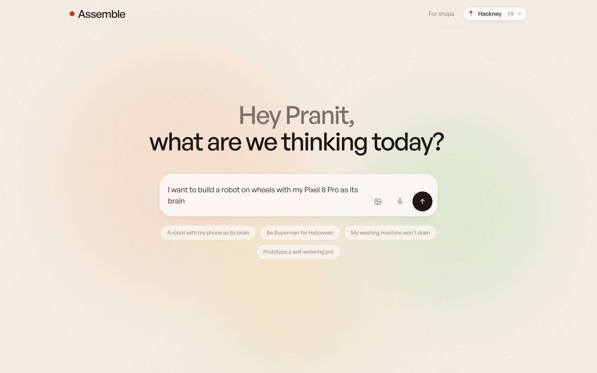
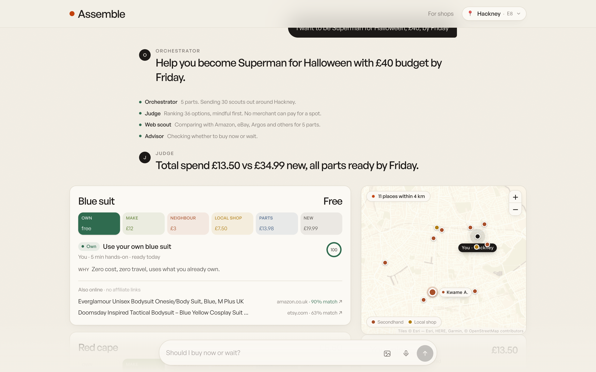
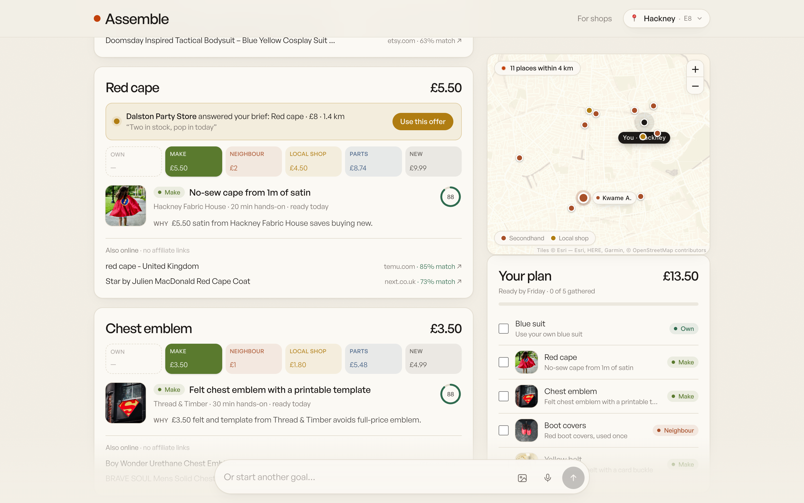
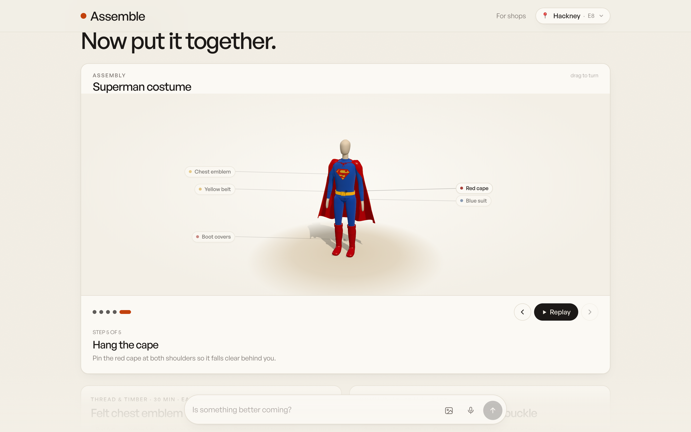
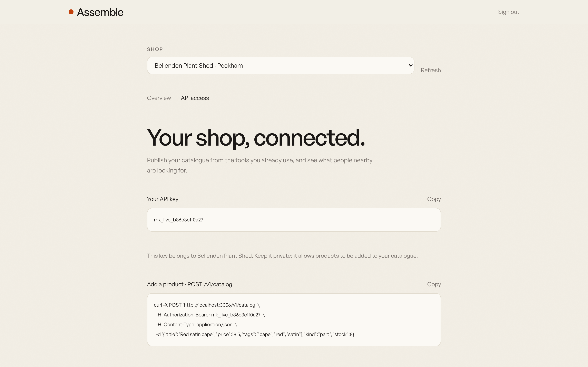

# Assemble

**Say what you want to do, not what to buy.** Assemble turns a goal into a mindful plan. For each part it checks, in order, what you already **own**, what you could **make**, what a **neighbour** is selling, what a **local walk-in shop** has, and only then what's **new**. No shop can pay to rank higher.

The whole platform lives inside a **Grok Bot VM**: the site is served live from that VM, Grok answers shoppers, and Grok bots run the business.

**Live:** https://sussex-placing-piano-suggestion.trycloudflare.com · Built at the Grok Bot Commerce Hackathon, London, 26 Sep 2026.



## What a shopper sees

"I want to be Superman for Halloween, £40, by Friday." Assemble asks two quick questions, splits the goal into parts and sends 30 scouts around Hackney. The plan: your own blue suit, a DIY cape, a neighbour's boot covers. **£13.50 against £34.99 for the boxed costume**, which is still one tap away.



Nobody nearby had a red cape, so local shops were asked. Dalston Party Store, a walk-in shop with no website, answered £8, and the offer lands on the shopper's plan within seconds.



Once every part is gathered, it shows how it goes together.



Other goals to try: *a robot on wheels with my Pixel 8 Pro as its brain* (£19 vs a £39.99 kit), *my washing machine won't drain* (free checks, then a repair café), *prototype a self-watering plant pot*. Any goal works: parts nobody nearby stocks show the best online links (Amazon, eBay, Etsy, Temu and more) with a match score, and never affiliate links.

## For local shops

Shops see what people near them need and answer it, from the portal or their own system through the API.



## How it works

| Agent | Job |
|---|---|
| Orchestrator | Reads the goal (and photo), asks up to 3 questions, splits it into parts |
| Six scouts | Own → DIY → Secondhand → Local walk-in → Parts → New, for every part at once |
| Judge | Ranks reuse and local first, then price, distance and deadline |
| Web scout | Finds the same part online via Tavily, with a match score |
| Advisor | "Buy now or wait? Is something better coming? Does it matter?" |
| Composer | Turns it all into the screen: map, part cards, cost comparison, checklist, 3D build |

The AI never writes UI: it fills a fixed set of cards defined in [`shared/genui.ts`](shared/genui.ts).

**Grok bots on the VM:** Infra (keys, restarts, deploys), Onboarder + Matchmaker (adds shops, relays their offers), and Vision (reads shoppers' photos). The backend can wake them with a webhook ([`server/trigger.ts`](server/trigger.ts)). The full map is in [docs/agent-map.md](docs/agent-map.md).

| Page | For |
|---|---|
| `/` | Shoppers |
| `/admin` | Local shops: requests near you, stock, API access |
| `/owner` | The operator: what people want, what nobody sells yet, shops |
| `/ops` | The Grok bots' task board |

## Run it

```bash
npm ci
npm run seed    # demo London: shops, stock, secondhand listings
npm run dev     # http://localhost:5173
```

It works without keys (rule-based fallbacks). Add `LLM_BASE_URL`, `LLM_API_KEY` and `LLM_MODEL` (any OpenAI-compatible API; we use xAI Grok) and `TAVILY_API_KEY` in `.env` for the full experience. `npm run check` and `npm run smoke` run before every PR. See [CONTRIBUTING.md](CONTRIBUTING.md).

**Stack:** Node 22, Express 5, React + Vite, Tailwind v4, SQLite (`node:sqlite`), Leaflet, three.js, zod. One process on the VM under pm2, public through a Cloudflare tunnel, auto-deployed from `main`.

**Built with** Claude Code, Codex, Cursor and Grok bots.
