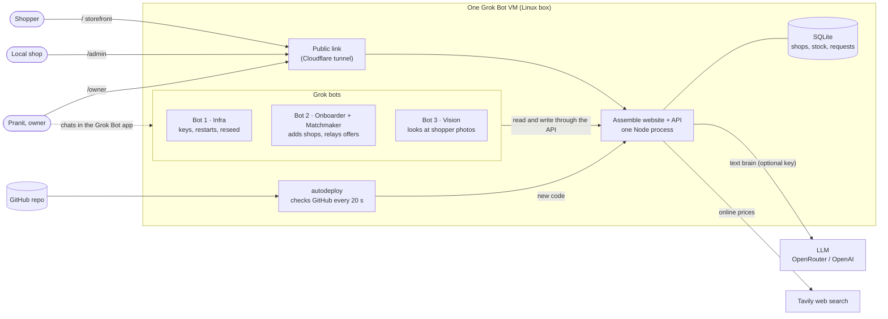

# Agent map: who does what

## The whole system on one page



## Inside the website: the AI team (this is code, not bots)

When a shopper types a goal, these run in order in about 5 seconds:

1. **Orchestrator** reads the goal (and photo). It asks up to 3 quick questions and splits the goal into parts. Example: Superman becomes suit, cape, emblem, belt, boots.
2. **Six scouts** check every part at the same time, in mindful order:
   **Own it?** → **Make it (DIY)** → **Secondhand nearby** → **Local shop walk-in** → **Parts** → **New**.
3. **Judge** ranks the options: reuse and local first, then price, distance and deadline. Shops can't pay to rank higher.
4. **Web scout** finds the same part on Amazon, eBay and Argos (via Tavily) so you can compare. No affiliate links.
5. **Advisor** answers "buy now or wait?": is something better coming, and does it even matter?
6. **Composer** turns all of that into the screen: map, part cards, cost comparison, local shop cards, checklist, then the 3D build.

If a part isn't available nearby, the website posts a **request** ("brief"). Nearby shops see it in `/admin`. When a shop answers, the offer appears on the shopper's plan within 3 seconds.

## The three journeys

| Shopper | Local shop | Owner (Pranit) |
|---|---|---|
| Says a goal, optionally adds a photo of what they have | Signs in at `/admin` | Opens `/owner` |
| Answers 2–3 quick questions | Sees "someone 1.4 km away needs a red cape" | Sees every shop, every request, and which parts nobody sells |
| Gets a plan: own → DIY → used → local → new, with map and prices | Replies with price and a note | Messages a Grok bot: "onboard Rosa's Fabrics in Dalston", and she's on the map |
| Picks, ticks parts off, then sees the 3D build | Gets a walk-in customer, not a delivery | Grows supply where demand is unmet |

## Who built what (harnesses)

| Tool | Built |
|---|---|
| **Claude Code** | Architecture, AI team, storefront, map, 3D, deploy pipeline |
| **Codex** | Shop API (`/v1`), merchant portal and catalogue |
| **Cursor** | Bot task board (`/ops`), "open requests near you" in the portal |
| **Grok bots** (on the VM) | Run operations live: server, shop onboarding, photo reading, matchmaking |
| **Teammates** | UI polish via pull requests |

## Where the code is

```
shared/genui.ts         the contract: every card the AI may show (the AI never writes UI)
server/agents/          orchestrator, scouts, judge, composer, web scout, advisor
server/routes/          shop.ts (shoppers), bridge.ts (requests/offers), merchant.ts, v1.ts, owner.ts, ops.ts, vision.ts
web/src/pages/          Home (storefront), admin/, Owner, ops/, Sell
web/src/components/     genui cards, map, 3D assembly, composer box
seed/                   demo London: 12 shops, 110 products, 41 secondhand listings
bots/                   instructions for each Grok bot
deploy/                 VM deploy + autodeploy scripts
```
